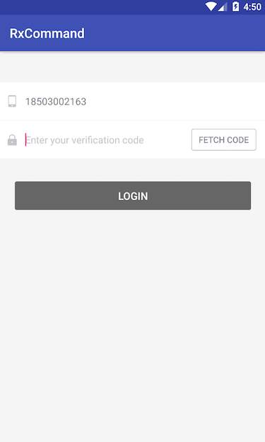

# RxCommand
一个基于RxJava，不需要借助XML来实现MVVM架构的轮子。 

## 为什么不用MVP 

MVP用接口隔离了view和presenter，需要定义接口，比较繁琐。在使用dagger这类依赖注入框架时，也不够便利，需要定义presenter的基类，也必须至少定义view的接口。presenter和view以接口的形式相互依赖，表面上它们是分离的，presenter对view是弱拥有关系，实际上presenter拥有对view的控制权，它们交互过于频繁，导致一个流程的代码散落在它们的各个角落，给阅读和理解代码带来不便。

## 为什么不用DataBinding

DataBinding需要把代码写到XML中，一方面不优雅，另一方面代码更为分散，无论是编写还是阅读测试维护都比较困难，实在是不喜欢。 

`RxJava + MVP`是目前比较流行的技术选型，只需要借助这个不到两百行代码的轮子，便可以轻松实现`RxJava + MVVM`。项目同时附加了demo。

## ViewModel

粗略地说，ViewModel和Presenter的职责是一样的，它们区别在于和View的协作方式。Presenter拥有对View的控制权，指挥View根据它的状态渲染界面。ViewModel不拥有View的引用，View观察ViewModel中状态的变化来主动地刷新自己的界面。所以MVP是命令式的，而MVVM是响应式的。

## 特性 

* 基于RxJava，拥有RxJava的所有优点
* 分离关注点，便于有选择地处理任务执行的状态（执行中，错误，完成等等）
* 不需要定义接口
* ViewModel是个普通类
* 相关代码集中，便于阅读和维护

## 使用 

### Demo 

 

我们需要做一个登录界面 

* 当手机号码不合法时，获取验证码按钮处于disable状态
* 当正在获取验证码时，获取验证码按钮处于disable状态，并显示loading
* 当获取验证码成功时，倒计时开始，按钮仍处于disable状态，倒计时结束，按钮重新可用
* 当获取验证码失败时，不会开始倒计时，按钮恢复可用状态
* 当手机号码和验证码都合法时，登录按钮处于可点击状态，否则不可点击
* 当点击登陆按钮时，登录按钮处于不可点状态，同时显示loading
* 当登录成功时，停止loading，跳转到主界面
* 当登录失败时，停止loading，并提示错误 

让我们来看看，要实现以上需求，LoginActivity该怎么写 

```java
//绑定用户输入到ViewModel
RxTextView.textChanges(phoneNumberEditText).subscribe(viewModel.phoneNumber());
RxTextView.textChanges(verificationCodeEditText).subscribe(viewModel.verificationCode());

//绑定按钮和command，当command正在执行或者输入不合法时，按钮将处于disable状态
RxCommandBinder.bind(verificationCodeButton, viewModel.verificationCodeCommand());
RxCommandBinder.bind(loginButton, viewModel.loginCommand());

//处理获取验证码执行状态
viewModel.verificationCodeCommand()
        .executing()
        .subscribe(executing -> {
            if (executing) {
                verificationCodeButton.setText("fetch...");
            } else {
                verificationCodeButton.setText("fetch code");
            }
        });

//处理获取验证码成功的情形，已经过滤了发生错误的情形，不需要在这里处理失败的情况
viewModel.verificationCodeCommand()
        .switchToLatest()
        .observeOn(AndroidSchedulers.mainThread())
        .subscribe(result -> Toast.makeText(LoginActivity.this, result, Toast.LENGTH_LONG).show());

//处理获取验证码成功后，正在倒数的情形
viewModel.countdownCommand()
        .switchToLatest()
        .observeOn(AndroidSchedulers.mainThread())
        .subscribe(s -> verificationCodeButton.setText(s));

//处理倒计时结束后的情形
viewModel.countdownCommand()
        .executing()
        .subscribe(executing -> {
            if (!executing) {
                verificationCodeButton.setText("fetch code");
            }
        });

//处理登录执行状态
disposable = viewModel.loginCommand()
        .executing()
        .subscribe(executing -> {
            if (executing) {
                loginButton.setText("login...");
            } else {
                loginButton.setText("login");
            }
        });

//处理登录失败或者获取验证码失败的情形
Observable.merge(
        viewModel.verificationCodeCommand().errors(),
        viewModel.loginCommand().errors())
        .subscribe(throwable ->
                Toast.makeText(LoginActivity.this, throwable.getLocalizedMessage(), Toast.LENGTH_LONG).show()
        );

//处理登录成功后的情形
viewModel.loginCommand()
        .switchToLatest()
        .observeOn(AndroidSchedulers.mainThread())
        .subscribe(success -> {
            if (success) {
                Toast.makeText(LoginActivity.this, "login success!! Now goto the MainActivity.", Toast.LENGTH_LONG).show();
            } else {
                Toast.makeText(LoginActivity.this, "login fail!!", Toast.LENGTH_LONG).show();
            }
        });
``` 

So，分离关注点后，是不是很清晰？代码也没有写得到处都是，是不是很好阅读？下载源码，运行demo来看看效果吧。

### 集成到项目

```gradle
repositories {
    maven {
        url "https://dl.bintray.com/listenzz/maven"
    }
}
``` 

```gradle
dependencies {
    compile 'com.shundaojia:rxcommand:1.0.0'
}
```
